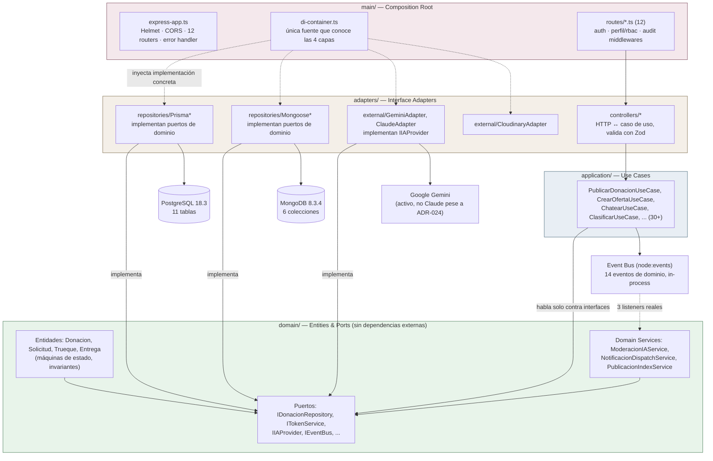
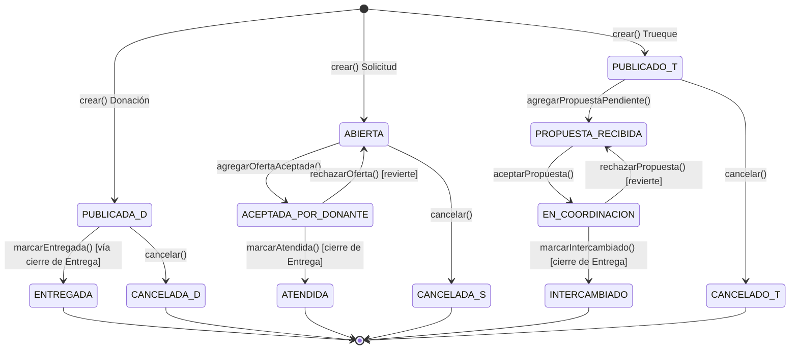

# 03 — Arquitectura Real — DonaConnect Ecuador

Identificación de la arquitectura real del backend y frontend, verificada contra código (no solo contra nombres de carpetas), con evidencia de dirección de dependencias, separación de responsabilidades y los puntos donde la arquitectura documentada se cumple o se rompe.

---

## 1. Qué arquitectura usa realmente

**Backend: combinación de DDD + Clean Architecture + Hexagonal (Ports & Adapters), monolito modular.** No es MVC clásico, no es microservicios, no es una arquitectura por capas técnica simple (`routes/controllers/services/models`).

### 1.1 Evidencia de las 4 capas y su dirección de dependencia

```
backend/
├── domain/        entidades, VOs, eventos, domain services, PUERTOS (interfaces)
├── application/    casos de uso — orquestan domain a través de puertos
├── adapters/       controllers HTTP, repositorios Prisma/Mongoose, clientes externos (Gemini, Cloudinary)
└── main/           composition root — Express app, di-container.ts, rutas, middlewares
```

Confirmado por listado real de 12 Bounded Contexts × 4 capas (`00_INVENTARIO_PROYECTO.md §2`), no solo por convención de nombres.

**Regla de dependencia verificada, no asumida:**
- `domain/` no importa Express, Prisma ni Mongoose. Ejemplo verificado: `ChatbotOrquestacionService` (`domain/ia/services/`) recibe `IIAProvider` por constructor (puerto), nunca importa `@google/genai` directamente — quien sí lo hace es `GeminiAdapter` (`adapters/ia/external/`).
- `application/` solo depende de `domain/` vía puertos. Ejemplo: `PublicarDonacionUseCase.ts:63` llama `eventBus.emit(...)` contra la interfaz `IEventBus` (`domain/eventos/ports/`), no contra `node:events` directamente.
- `adapters/` implementa los puertos de `domain/`. Ejemplo: `PrismaDonacionRepository` implementa `IDonacionRepository`; `GeminiAdapter`/`ClaudeAdapter` implementan `IIAProvider` — **ambos coexisten en código**, prueba práctica de que el puerto realmente desacopla (cambiar de proveedor es una línea en `di-container.ts:295`, no tocar ningún caso de uso).
- `main/` es el único lugar que conoce las 4 capas: `di-container.ts` instancia cada adaptador concreto (`JwtTokenService`, `BcryptPasswordHasher`, `GeminiAdapter`, `PrismaXRepository`, `MongooseXRepository`) y los inyecta en los casos de uso vía constructor. Las rutas (`main/routes/*.ts`) importan controllers ya armados desde `di-container.ts`, nunca instancian sus propias dependencias.

**Path aliases** (`@domain/*`, `@application/*`, `@adapters/*`, `@main/*`) confirmados en imports reales vistos durante esta auditoría (ej. `import { IAProviderNoConfiguradoError } from '@adapters/ia/external/ClaudeAdapter.js'` en `error-handler.middleware.ts:56`) — evita rutas relativas frágiles al cruzar de capa.

### 1.2 Dónde la arquitectura se rompe (evidencia real, no hipotética)

- **Acoplamiento residual al adapter no cableado:** `error-handler.middleware.ts:56` importa una clase de error **desde `ClaudeAdapter.ts`**, aunque el proveedor activo en runtime es `GeminiAdapter`. Funciona porque `ClaudeAdapter.ts` re-exporta esa clase desde `domain/ia/ports/IIAProvider.ts` (mismo símbolo), pero es un indicio de que el error debería importarse directamente del puerto, no de un adaptador concreto — cuidado si algún día se elimina `ClaudeAdapter.ts` sin corregir este import.
- **`main/` como único lugar consciente de las 4 capas** es coherente con Clean Architecture, pero también significa que `di-container.ts` es un archivo grande (~430 líneas) con alta responsabilidad de cableado — es el costo aceptado de centralizar el composition root en vez de dispersarlo.
- **Autorización a nivel de recurso** (dueño vs. tercero) vive dentro de cada caso de uso, no en un middleware separado — decisión documentada (no un descuido), pero significa que la regla "solo el dueño puede cancelar su donación" no es visible con solo mirar `main/routes/donaciones.routes.ts`; hay que entrar al caso de uso.

### 1.3 Frontend: arquitectura espejo (feature-based, funcional)

```
frontend/src/
├── app/            App.tsx (rutas), layouts/, pages/
├── features/<dominio>/{api,components,hooks,types}/   13 módulos, mismo nombre que el BC del backend
└── shared/{components/{atoms,molecules,organisms},hooks,lib}/
```

Regla de reutilización verificada: `shared/components/` solo aloja componentes que reciben todo por props (`PublicacionCard.tsx`, `LocationPicker.tsx`, etc. — confirmado que no importan hooks de `features/*`); los wizards (`DonacionWizard.tsx`, etc.) viven en `features/<dominio>/components/` porque orquestan lógica propia del dominio.

Estilo funcional puro confirmado: solo function components en las 17 páginas leídas, estado de servidor con TanStack Query, estado local con `useState` — sin Redux/Zustand en `package.json`.

---

## 2. ¿Por qué esta arquitectura es defendible para DonaConnect?

| Pregunta | Respuesta con evidencia |
|---|---|
| ¿Qué problema resuelve? | Permite cambiar de proveedor de IA (Claude→Gemini, ya ocurrió realmente) sin tocar ningún caso de uso — un solo cambio en `di-container.ts:295`. Es la prueba práctica de que el desacoplamiento no es solo teórico. |
| ¿Qué ventaja aporta frente a MVC simple? | Los casos de uso son testeables sustituyendo adaptadores por dobles de prueba, sin levantar Postgres/Mongo/Gemini reales — confirmado por la existencia de 5 archivos de test de integración que usan Supertest contra la app completa, no mocks profundos de infraestructura. |
| ¿Qué complejidad introduce? | Un archivo de composition root grande (`di-container.ts`, ~430 líneas) y la necesidad de definir un puerto por cada dependencia externa antes de poder usarla — overhead real para un proyecto de este tamaño, aceptado explícitamente en ADR-042/044 como trade-off consciente. |
| ¿Por qué no microservicios (ADR-007)? | Monolito modular en un solo proceso, en `localhost` (ADR-000) — un broker distribuido o despliegue independiente por módulo no aporta nada a un MVP académico de 6 semanas; la modularidad real (fronteras de Bounded Context) ya se logra con las carpetas y las interfaces. |
| ¿Qué se sacrifica? | Escalado y despliegue independientes por módulo — no son requisitos reales aquí. |
| ¿Dónde es más defendible el diseño? | La migración Rol↔PerfilFuncional (ADR-048/049, §6.1 de `docs/MANUAL_DEFENSA_PROYECTO.md`): nació de una auditoría real, se ejecutó con `expand-and-contract` (no un cast directo) sobre datos de usuarios reales, y corrigió de paso un hallazgo de seguridad genuino (el registro público podía crear `ADMINISTRADOR`). |

---

## 3. Diagrama de arquitectura (backend)



**Lectura del diagrama:** las flechas sólidas son dependencias reales de import; las punteadas son cableado en runtime (inyección de dependencias / suscripción a eventos), no imports directos. Ningún módulo de `application/` o `domain/` apunta hacia `adapters/` o `main/` — la flecha siempre va de afuera hacia adentro o pasa por una interfaz.

---

## 4. Persistencia — resumen de evidencia (detalle completo en la futura entrega `10_POSTGRESQL_Y_MONGODB.md`)

**Principio de frontera (ADR-012), confirmado en el esquema real:** Postgres = estado transaccional con máquinas de estado e invariantes (`schema.prisma`, 11 tablas, ver `backend/prisma/schema.prisma:55-367`); Mongo = datos conversacionales/append-only (6 colecciones, ver `00_INVENTARIO_PROYECTO.md §4`).

Máquinas de estado reales (transiciones que **sí** ocurren en código, confirmadas método por método):
- `Donacion`: `PUBLICADA → {ENTREGADA | CANCELADA}` únicamente.
- `Solicitud`: `ABIERTA → ACEPTADA_POR_DONANTE → ATENDIDA`, o `→ CANCELADA` en cualquier punto no terminal; `agregarOfertaAceptada()` guarda contra doble-oferta y contra estado no receptivo.
- `Trueque`: `PUBLICADO → PROPUESTA_RECIBIDA → EN_COORDINACION → INTERCAMBIADO`, o `→ CANCELADO`; único con reversión real (`rechazarPropuesta()` puede devolver de `EN_COORDINACION` a `PROPUESTA_RECIBIDA` o a `PUBLICADO`).
- `Entrega`: `PROGRAMADA → {CONFIRMADA | CANCELADA}`, polimórfica sobre Donación/Trueque.



**Nota de evidencia:** los enums de Prisma declaran más estados de los que el código realmente asigna (`EstadoDonacion.SOLICITADA/APROBADA/EN_RETIRO`, `EstadoSolicitud.EN_REVISION/EN_ENTREGA`, `EstadoTrueque.ACEPTADO` — ver `02_TRAZABILIDAD_SRS_CODIGO.md §3.5`). El diagrama de arriba muestra el flujo **real**, no el enum completo.

---

## 5. Seguridad — resumen de evidencia (detalle completo en la futura entrega `13_SEGURIDAD.md`)

| Control | Estado real | Evidencia |
|---|---|---|
| Hash de contraseñas | bcrypt, 10 rondas | `BcryptPasswordHasher.ts:4` |
| JWT | HS256, 8h, sin refresh | `JwtTokenService.ts:4,13-15` |
| Payload JWT | `sub`, `rol`, `perfiles[]` | `ITokenService.ts:4-11` |
| Autorización de marketplace | `perfilMiddleware([...])` sobre `PerfilFuncional` | `donaciones/solicitudes/trueques.routes.ts` |
| Autorización administrativa | `rbacMiddleware(['ADMINISTRADOR'])` sobre `Rol` | `admin.routes.ts:9`, `categorias.routes.ts:8` |
| Cabeceras HTTP | Helmet, configuración por defecto | `express-app.ts:24` |
| CORS | origen único (`CORS_ORIGIN`, default `localhost:5173`), `credentials:false` | `express-app.ts:25`, `env.ts:16` |
| **Rate limiting** | **No implementado**, pese a ADR-034 | ausencia total en `backend/` (ver `02_TRAZABILIDAD_SRS_CODIGO.md` hallazgo #2) |
| Auditoría | post-hoc, no bloqueante, 14 acciones cubiertas (10 rutas) | `audit.middleware.ts:55-83` |
| Ubicación exacta | oculta por defecto en endpoints públicos (ADR-019) | pendiente de re-verificar línea exacta en el DTO — marcar como **Decisión documentada**, no reverificada en esta pasada |
| HTTPS | excepción documentada (ADR-006), HTTP en localhost | — |

---

## 6. Preguntas de arquitectura para la defensa (con respuesta corta)

**¿Por qué DDD + Clean + Hexagonal juntos y no uno solo?** Resuelven problemas distintos: DDD decide *qué modelar* (12 Bounded Contexts), Clean Architecture decide *cómo se organizan las capas y la regla de dependencia*, Hexagonal decide *cómo el núcleo habla con el exterior* (puertos/adaptadores). No compiten, se combinan — la prueba concreta es que cambiar de Claude a Gemini fue una línea de código, no un refactor.

**¿Cómo se garantiza que el dominio no dependa de Express o Prisma?** Los casos de uso reciben interfaces por constructor; nunca importan `express`/`@prisma/client`. La única prueba real de esto en el repo: `ChatbotOrquestacionService` no sabe si detrás de `IIAProvider` hay Gemini o Claude.

**¿Qué pasaría si se elimina la capa `adapters/`?** Los casos de uso dejarían de tener implementaciones reales para sus puertos — compilarían (las interfaces siguen en `domain/`) pero no habría forma de correr la aplicación. Es la capa que "enchufa" el dominio al mundo real.

**¿Dónde se nota que la arquitectura no es perfecta?** El import cruzado de `error-handler.middleware.ts` hacia `ClaudeAdapter.ts` (ver §1.2) y que `di-container.ts` es un archivo único de ~430 líneas — el costo real de centralizar el composition root.

**¿Por qué Event Bus in-process y no un broker externo?** 14 eventos de dominio, 3 listeners reales, todo en un solo proceso Node — un broker (Kafka/RabbitMQ) agregaría infraestructura sin beneficio a esta escala (ADR-023). El acoplamiento que sí importaba evitar (Donaciones no debe conocer a Notificaciones) ya se resuelve con eventos nombrados.

---

## 7. Qué sigue

Con `00_INVENTARIO_PROYECTO.md`, `02_TRAZABILIDAD_SRS_CODIGO.md` y este documento, el "mapa completo del sistema" pedido como primer paso queda entregado. Recomiendo que la siguiente fase de esta auditoría sea, en este orden: (1) `17_DEUDA_TECNICA.md` (consolida los 12 hallazgos ya detectados con prioridad de arreglo), (2) `12_API_ENDPOINTS.md` (catálogo completo, ya tengo casi todos los endpoints relevados en esta pasada), (3) `13_SEGURIDAD.md` (profundizar el hallazgo del rate limiting ausente). El análisis línea por línea (`05_EXPLICACION_CODIGO.md`) y el banco de 80 preguntas quedan para después de cerrar esos tres, dado que son los de mayor volumen.
