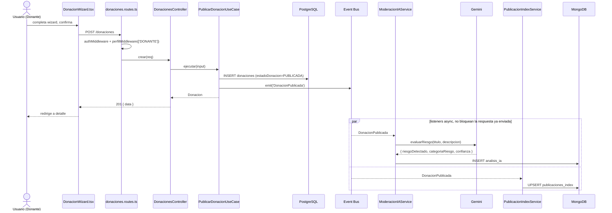
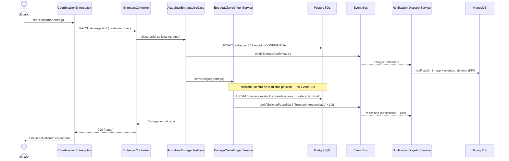

# 04 — Comunicación entre Capas — DonaConnect Ecuador

Traza real (archivo:línea) de los 14 flujos pedidos, de punta a punta: `Usuario → Frontend → HTTP → Ruta → Middleware → Controller → Caso de uso → Repositorio → BD/servicio externo → Respuesta → UI`. Evidencia acumulada de `00`-`03`, `12`, `13`, más lectura directa adicional de los domain services de Entregas, IA y Mensajería para este documento.

## Responsabilidad y contrato de cada capa (recordatorio de `03_ARQUITECTURA.md`, aplicado a cada flujo)

| Capa | Recibe | Transforma en | Devuelve | No debe conocer |
|---|---|---|---|---|
| `main/routes` | `Request` de Express | invocación a un método de controller ya armado por `di-container.ts` | — | lógica de negocio, Prisma/Mongoose |
| `adapters/*/controllers` | `req.body`/`req.query`/`req.params` | DTO validado por Zod, input del caso de uso | `res.json`/`res.status` (envelope `{data}`/`{error}`) | reglas de negocio (solo empaqueta) |
| `application/*/use-cases` | DTO ya validado + identidad del solicitante | invariantes del dominio vía métodos de la entidad, llamadas a puertos | entidad o DTO de respuesta | Express, Prisma, Mongoose, SDKs externos |
| `domain/*` | primitivos/VOs | estado interno de la entidad, eventos a emitir | la propia entidad / lanza error de dominio | cualquier capa externa |
| `adapters/*/repositories`, `adapters/*/external` | entidad de dominio o parámetros primitivos | fila SQL / documento Mongo / request HTTP a un proveedor | entidad reconstruida / DTO de resultado | reglas de negocio |

---

## 1. Registro de usuario (CU-001)

```
Usuario → RegistroForm.tsx (perfiles[] por checkboxes, ya no "rol")
  → POST /auth/registro { nombre, correo, password, telefono?, perfiles[], aceptaTerminos:true }
  → identidad.routes.ts:11 (auditarRegistro, sin authMiddleware — endpoint público)
  → AuthController.registro (auth.controller.ts:13-21): registroSchema.parse(req.body)
  → RegistrarUsuarioUseCase.ejecutar (líneas 36-59):
      1. usuarioRepository.buscarPorCorreo → si existe: CorreoYaRegistradoError (409)
      2. passwordHasher.hash(password) → BcryptPasswordHasher (10 rondas)
      3. Usuario.crear({ ..., rol: 'USUARIO' })  ← hardcodeado, ya no viene del input (ADR-048)
      4. usuarioRepository.crear(usuario)                    → Postgres INSERT usuarios
      5. usuarioPerfilRepository.asignarPerfil() × N perfiles → Postgres INSERT usuarios_perfiles
      6. eventBus.emit('UsuarioRegistrado', { id, nombre })
         → NotificacionDispatchService.alUsuarioRegistrado (di-container.ts:421) — único listener,
           genera una notificación in-app de bienvenida; no hay listener de moderación IA ni de
           indexación de publicaciones para este evento (no aplica, un usuario no es una publicación)
  → 201 { data: usuario.toJSON() }
  → RegistroPage.tsx redirige a /login (no auto-login)
```

---

## 2. Iniciar sesión (CU-002)

```
Usuario → LoginPage.tsx → POST /auth/login { correo, password }
  → identidad.routes.ts:12 (sin middleware)
  → AuthController.login → loginSchema.parse
  → IniciarSesionUseCase.ejecutar (líneas 42-68):
      1. buscarPorCorreo → si no existe: CredencialesInvalidasError (401), SIN auditar
         (auditoria.id_entidad es NOT NULL, no hay usuario.id disponible — ambigüedad de Fase 9)
      2. passwordHasher.compare → si falla: auditoriaRepository.registrar(LOGIN_FALLIDO) [best-effort,
         catch silencioso] → CredencialesInvalidasError (401)
      3. usuario.estaActivo() → si no: UsuarioInactivoError (403)
      4. usuarioPerfilRepository.listarPerfiles(usuario.id)  → Postgres SELECT usuarios_perfiles
      5. tokenService.generar({ sub, rol, perfiles }) → JwtTokenService, HS256, 8h
  → 200 { data: { token, usuario } }
  → LoginPage.tsx guarda token en sessionStorage, redirige a /
```

---

## 3. Publicar una donación (CU-003) — incluye la reacción asíncrona de moderación IA

```
Usuario → DonacionWizard.tsx (5 pasos, IASuggestionBox opcional en el paso final)
  → POST /donaciones { titulo, descripcion, categoriaId, estadoObjeto, requiereRetiro, ubicacionRetiro? }
  → donaciones.routes.ts:22: authMiddleware → soloDonante (perfilMiddleware(['DONANTE'])) → auditarCreacion
  → DonacionesController.crear → crearDonacionSchema.parse
  → PublicarDonacionUseCase.ejecutar:
      1. valida categoría contra Postgres (CategoriaInvalidaError si no existe/inactiva)
      2. arma la entidad Donacion.crear() → estadoDonacion='PUBLICADA'
      3. donacionRepository.crear() → PrismaDonacionRepository → Postgres INSERT donaciones
      4. eventBus.emit('DonacionPublicada', { id, titulo, donanteId, estadoDonacion })  [línea 63]
  → 201 { data: donacion }
  → DonacionWizard.tsx redirige a /donaciones/:id

  EN PARALELO, dentro del mismo tick de Node (Event Bus in-process, no hay red de por medio) pero
  SIN bloquear la respuesta HTTP ya enviada — 2 listeners reaccionan a 'DonacionPublicada':

  3a. ModeracionIAService.evaluarYRegistrar (di-container.ts:344)
      → iaProvider.evaluarRiesgo(titulo, descripcion) → GeminiAdapter → Gemini API (JSON estructurado)
      → analisisIARepository.registrar() → Mongo analisis_ia
      → si riesgoDetectado: eventBus.emit('RiesgoDetectado', {...}) → NotificacionDispatchService
        crea notificación in-app para administradores (no bloquea ni oculta la publicación — ADR-010/027)

  3b. PublicacionIndexService.alDonacionPublicada (di-container.ts:405)
      → publicacionIndexRepository.indexar() → Mongo publicaciones_index (proyección "mis publicaciones")
```



---

## 4. Crear solicitud de ayuda (CU-005)

Mismo patrón que §3, con `SOLICITANTE` en vez de `DONANTE`, `CrearSolicitudUseCase.ts:62` emitiendo `SolicitudCreada`, y los mismos 2 listeners reaccionando (`ModeracionIAService` en `di-container.ts:352`, `PublicacionIndexService` en `di-container.ts:408`).

---

## 5. Aceptar solicitud como donante (CU-006) — 1 paso, con creación síncrona de Entrega

```
Usuario → SolicitudDetallePage.tsx (botón "Ofertar", visible si PERFILES_PUEDEN_OFERTAR)
  → POST /solicitudes/:id/ofertas { donacionId, mensaje? }
  → solicitudes.routes.ts:34: authMiddleware → soloDonante → auditarAprobarOferta
  → SolicitudesController.crearOfertaHandler → crearOfertaSchema.parse
  → CrearOfertaUseCase.ejecutar (líneas 47-91):
      1. valida: no es dueño de su propia solicitud, la donación existe y es del donante
      2. solicitud.agregarOfertaAceptada() → Solicitud pasa a ACEPTADA_POR_DONANTE (1 solo paso, RF-009)
      3. solicitudRepository.actualizar() → Postgres UPDATE solicitudes + INSERT ofertas_solicitud
      4. eventBus.emit('OfertaRecibida', {...})              → notifica al beneficiario
      5. eventBus.emit('SolicitudAceptadaPorDonante', {...}) → notifica + indexa (PublicacionIndexService)
      6. entregaCoordinacionService.crear({ tipoOperacion:'DONACION', idReferencia: donacion.id, ... })
         → SÍNCRONO, no vía Event Bus (a diferencia de la moderación IA) — Entrega.crear() → Postgres
           INSERT entregas (estado=PROGRAMADA) → eventBus.emit('EntregaProgramada', {...})
  → 201 { data: solicitud.toJSON({ incluirUbicacionExacta: true, solicitanteId: donanteId }) }
    ← el donante ve la ubicación EXACTA de la solicitud en ESTA respuesta puntual (ver 13_SEGURIDAD.md §3)
  → SolicitudDetallePage.tsx muestra confirmación + CoordinacionEntrega.tsx con la Entrega recién creada
```

**Por qué es síncrono y no por Event Bus (evidencia del propio código, `EntregaCoordinacionService.ts:14-16`):** alcanzar el registro de una Entrega es un flujo Must-have — no debe depender de un listener best-effort que puede fallar en silencio, a diferencia de la moderación IA (Should-have, que sí tolera fallo silencioso por diseño).

---

## 6. Publicar objeto para trueque (CU-007) y 7. Proponer trueque (CU-008)

Publicar: mismo patrón que §3 (`PublicarTruequeUseCase.ts:51` emite `TruequePublicado`). Proponer (2 pasos, a diferencia de Solicitud):
```
POST /trueques/:id/propuestas → soloTrueque → ProponerTruequeUseCase.ejecutar
  → Trueque.agregarPropuestaPendiente() → PROPUESTA_RECIBIDA (NO auto-acepta)
  → eventBus.emit('PropuestaTruequeRecibida', {...}) → notifica al dueño del trueque origen
  → 201, sin crear Entrega todavía — eso ocurre recién al aceptar (§8)
```

---

## 8. Aceptar/rechazar propuesta de trueque — aceptación bilateral (RF-013)

```
PATCH /trueques/:id/propuestas/:propuestaId { aceptar: true }
  → auditarAprobarPropuesta → ResponderPropuestaUseCase.ejecutar
      1. truequeOrigen.aceptarPropuesta() → EN_COORDINACION
      2. truequeOfrecido.marcarEnCoordinacion() → EN_COORDINACION (el OTRO lado, 2do aggregate)
      3. eventBus.emit('TruequeAceptadoBilateralmente', { truequeOrigenId, truequeOfrecidoId, ... })
         → PublicacionIndexService actualiza AMBOS lados en publicaciones_index (di-container.ts:416)
      4. entregaCoordinacionService.crear({ tipoOperacion:'TRUEQUE', idReferencia: truequeOrigen.id,
         requiereRetiro: false })  ← Trueque no modela ubicación de retiro, a diferencia de Donación
  → 200 { data: truequeOrigen.toJSON() }
```

---

## 9. Conversar con chatbot IA (CU-009)

```
Usuario → ChatWidget.tsx (o ChatbotPage.tsx) → POST /chatbot/mensajes { texto, sesionId }
  → ia.routes.ts:9: authMiddleware
  → IaController.chatear → chatbotMensajeSchema.parse
  → ChatearUseCase → ChatbotOrquestacionService.chatear (líneas 37-61):
      1. conversacionRepository.buscarPorUsuarioId → si no existe, crea (1 documento por usuario)
      2. arma historial acotado a los últimos 15 mensajes previos
      3. iaProvider.chat(texto, historial) → GeminiAdapter.chat() → Gemini (texto libre, sin JSON Schema,
         systemInstruction = SYSTEM_PROMPT_CHATBOT, maxOutputTokens:1024)
      4. push mensaje usuario + mensaje bot al array embebido
      5. conversacionRepository.actualizar() → Mongo UPDATE chatbot_conversaciones
  → 200 { data: { conversacionId, respuesta } }
  → ChatWidget.tsx muestra la respuesta — SIN try/catch: si cualquier paso anterior falla
    (503 IAProviderNoConfiguradoError u otro), el usuario no ve ningún mensaje de error (ver 02 y 13)
```

---

## 10. Coordinar entrega o retiro / confirmar entrega (CU-010) — cierre en cascada síncrona

```
Usuario (donante o beneficiario, según rol en la Entrega) → CoordinacionEntrega.tsx → botón "Confirmar"
  → PATCH /entregas/:id { confirmar: true, fechaProgramada? }
  → entregas.routes.ts:13: authMiddleware (sin perfilMiddleware — la autorización de "quién puede
    confirmar" vive dentro del caso de uso vía NoAutorizadoParaLaEntregaError)
  → EntregasController.actualizar → actualizarEntregaSchema.parse
  → ActualizarEntregaUseCase.ejecutar (línea 51 emite EntregaConfirmada):
      1. entrega.confirmar() → Entrega.estado = CONFIRMADA (guarda EntregaYaFinalizadaError)
      2. entregaRepository.actualizar() → Postgres UPDATE entregas
      3. eventBus.emit('EntregaConfirmada', {...})
         → NotificacionDispatchService: notifica + registra en Mongo eventos_sistema (KPI, TTL 90 días)
      4. entregaCierreOrigenService.cerrarOrigen(entrega)  ← SÍNCRONO, dentro de la misma petición HTTP,
         NO vía Event Bus (decisión explícita: "alcanzar el estado terminal de un flujo Must-have no
         debe depender de un listener best-effort", EntregaCierreOrigenService.ts:11-15):
           - tipoOperacion=DONACION: donacion.marcarEntregada() [Postgres] +
             solicitud correspondiente (buscarPorOfertaDonacionAceptada) .marcarAtendida() [Postgres] +
             emit('SolicitudAtendida')
           - tipoOperacion=TRUEQUE: truequeOrigen.marcarIntercambiado() + emit('TruequeIntercambiado') +
             busca la propuesta ACEPTADA → truequeOfrecido.marcarIntercambiado() (el OTRO lado) +
             emit('TruequeIntercambiado') de nuevo (2 emisiones, una por cada aggregate)
  → 200 { data: entrega }
```



---

## 11. Administrar publicaciones (CU-011)

```
Admin → AdminPage.tsx (tab Publicaciones) → PATCH /admin/{donaciones|solicitudes|trueques}/:id/moderar
  { accion: 'APROBAR'|'BLOQUEAR'|'ELIMINAR' }
  → admin.routes.ts: authMiddleware → soloAdministrador (rbacMiddleware(['ADMINISTRADOR']))
    → auditarDonaciones/Solicitudes/Trueques (condicionado a la acción exacta, 3 middlewares)
  → AdminController.moderarX → moderarSchema.parse
  → ModerarPublicacionUseCase.ejecutar('DONACION'|'SOLICITUD'|'TRUEQUE', id, accion)
      → PublicacionNoEncontradaParaModerarError si no existe
      → actualiza el repositorio correspondiente → Postgres
      → ModeracionService emite 'PublicacionModerada' (líneas 62/73/83, una por verbo)
  → 200 { data }
```

---

## 12. Ver dashboard de impacto (CU-012)

```
Usuario → HomePage.tsx (autenticado) → GET /dashboard/impacto
  → dashboard.routes.ts:9: authMiddleware (pero el handler ignora la identidad, `_req` — §17_DEUDA_TECNICA #18)
  → DashboardController.obtenerImpacto → ObtenerDashboardImpactoUseCase → DashboardQueryService
      → consultas de conteo directas a Postgres (donaciones/solicitudes/trueques por estado)
      → + MongooseEventoSistemaRepository → Mongo eventos_sistema (solo 3 tipos: SolicitudAtendida,
        TruequeIntercambiado, EntregaConfirmada — TTL 90 días)
  → 200 { data: impacto } → HomePage.tsx renderiza 4 DashboardStatTile
```

---

## 13. Recibir sugerencia de clasificación IA (CU-013) y 14. Recibir recomendaciones de coincidencia (CU-014)

```
Usuario → dentro del wizard (paso final) → IASuggestionBox.tsx → POST /ia/clasificar { titulo, descripcion, esSolicitud? }
  → ia.routes.ts:11: authMiddleware → IaController.clasificar → ClasificarUseCase → ClasificacionService:
      1. lee categorías ACTIVA desde Postgres → construye el `enum` del JSON Schema en vivo
      2. iaProvider.clasificar() → GeminiAdapter (responseMimeType:'application/json' + responseSchema)
      3. NO persiste en analisis_ia (la publicación aún no existe — comentario explícito en el código)
  → 200 { data: { categoriaSugerida, tituloSugerido, descripcionSugerida, prioridadSugerida? } }
  → usuario acepta o edita la sugerencia antes de enviar el formulario real (POST /donaciones, etc.)

Usuario → MatchesSugeridos.tsx (en la página de detalle) → GET /ia/matching?entidadTipo=X&entidadId=Y
  → IaController.matching → ObtenerMatchesUseCase → MatchingService.buscarCoincidencias:
      1. preselección determinista en Postgres por categoría+estado, máx. 10 candidatos
      2. iaProvider.matchScore() por candidato, EN PARALELO (Promise.all)
      3. ordena: urgencia alta primero, luego score IA descendente
  → 200 { data: [...] }
```

---

## 15. Enviar mensaje a otro usuario (CU-015)

```
Usuario → ConversacionesPage.tsx → POST /conversaciones/:id/mensajes { texto }
  ← ":id" aquí es el ID DEL DESTINATARIO, no de la conversación (decisión documentada,
    EnviarMensajeUseCase.ts:26-29: "no existe POST /conversaciones explícito — la conversación se
    crea implícitamente al primer mensaje entre dos usuarios")
  → mensajeria.routes.ts:11: authMiddleware
  → MensajeriaController.enviarMensaje → enviarMensajeSchema.parse
  → EnviarMensajeUseCase.ejecutar:
      1. valida autorId !== destinatarioId, destinatario existe
      2. conversacionRepository.buscarPorParticipantes() → si no existe, Conversacion.crear()
      3. conversacion.agregarMensaje() → conversacionRepository.actualizar() → Mongo UPDATE mensajes
  → 201 { data: conversacion } → sin evento de dominio emitido (a diferencia de los demás flujos,
    Mensajería no dispara Notificaciones — confirmado por grep, no hay 'MensajeEnviado' en
    NombreEventoDominio; el destinatario se entera al hacer polling de GET /conversaciones)
```

---

## 16. Recibir notificación del sistema (CU-016)

No es un flujo iniciado por el usuario — es la reacción transversal de `NotificacionDispatchService`, suscrito a **13 de los 14 eventos de dominio** (`di-container.ts:421-459`, contado directamente: `UsuarioRegistrado`, `DonacionPublicada`, `OfertaRecibida`, `SolicitudAceptadaPorDonante`, `SolicitudAtendida`, `TruequePublicado`, `PropuestaTruequeRecibida`, `TruequeAceptadoBilateralmente`, `TruequeIntercambiado`, `EntregaProgramada`, `EntregaConfirmada`, `PublicacionModerada`, `RiesgoDetectado`). **El único evento sin listener de notificación es `SolicitudCreada`** — crear una solicitud indexa (`PublicacionIndexService`) y dispara moderación IA (`ModeracionIAService`), pero no genera ninguna notificación in-app a nadie; tiene sentido (nadie necesita ser avisado de que apareció una solicitud pública nueva), pero vale tenerlo verificado en vez de asumido si se pregunta por simetría entre los 3 módulos de marketplace. Cada método `al*` (`NotificacionDispatchService.ts:55-146`) escribe en Mongo `notificaciones`; el frontend hace polling de `GET /notificaciones` (campana en `Navbar.tsx`) — no hay WebSocket ni Server-Sent Events, confirmado por ausencia de esas dependencias en `package.json`.

---

## Qué sigue

Con este documento, `03_ARQUITECTURA.md` (capas) y `02`/`12` (contratos), el "cómo se comunican las piezas" queda cubierto para los 16 CU. Sigue `10_POSTGRESQL_Y_MONGODB.md` (diccionario de datos completo) y `11_REGLAS_DE_NEGOCIO.md` (máquinas de estado con cada guarda documentada).
