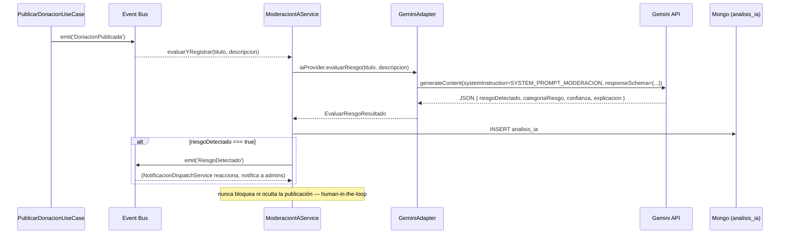

# 08 — Inteligencia Artificial — DonaConnect Ecuador

Análisis del proveedor de IA **realmente** cableado en el código (Google Gemini, no Claude/Anthropic como documenta el diseño original ADR-024 — ver `02_TRAZABILIDAD_SRS_CODIGO.md §2`), verificado archivo por archivo.

---

## 1. Qué es Gemini y qué SDK se usa

**Google Gemini** es la familia de modelos multimodales de Google. El proyecto usa el SDK oficial `@google/genai` (`^2.10.0`, confirmado en `backend/package.json`), a través de la clase `GoogleGenAI` (`GeminiAdapter.ts:1`). No se usa la API REST directa ni un wrapper de terceros.

## 2. Modelos configurados (diferenciados por tarea, mismo criterio documentado para Claude en ADR-024)

| Tarea | Modelo | Por qué (comentario real del código, `GeminiAdapter.ts:32-37`) |
|---|---|---|
| Chatbot (`chat()`) | `gemini-3.5-flash` | "mejor calidad conversacional dentro del tier Flash" |
| Clasificación, Matching, Moderación | `gemini-2.5-flash-lite` | "más barato/rápido, tareas acotadas de alto volumen" |

## 3. Carga de la API key

`env.ts:25`: `IA_API_KEY: process.env.IA_API_KEY ?? ''` — una sola variable genérica (no `GEMINI_API_KEY` diferenciada), pese a que hoy solo se usa para Gemini. `di-container.ts:295`: `new GeminiAdapter(env.IA_API_KEY)`.

## 4. Inicialización del cliente

`GeminiAdapter.ts:41-43`:
```ts
constructor(apiKey: string) {
  this.client = apiKey ? new GoogleGenAI({ apiKey }) : null;
}
```
Si la key está vacía (no configurada), `client` queda `null` — **no lanza en el constructor**. El error se difiere al primer uso real (`requerirCliente()`, líneas 45-48: lanza `IAProviderNoConfiguradoError` si `client` es `null`), que el `error-handler.middleware.ts` mapea a `503 SERVICE_UNAVAILABLE`. Es un patrón de **degradación explícita** — el proceso entero no crashea si falta la key, solo esa funcionalidad puntual responde 503 cuando se invoca (RNF-002).

## 5. Cómo se envía cada tipo de solicitud

### 5.1 Chatbot (`chat()`, líneas 50-69) — texto libre, con historial

```ts
const contents: Content[] = historial.slice(-15).map((m) => ({
  role: m.rol === 'usuario' ? 'user' : 'model',
  parts: [{ text: m.texto }],
}));
contents.push({ role: 'user', parts: [{ text: mensaje }] });

const response = await client.models.generateContent({
  model: 'gemini-3.5-flash',
  contents,
  config: { systemInstruction: SYSTEM_PROMPT_CHATBOT, maxOutputTokens: 1024 },
});
return response.text ?? '';
```
`systemInstruction` va en un canal separado de `contents` (API de Gemini) — no se mezcla con los mensajes del usuario. Sin `responseSchema`: la única de las 4 llamadas que devuelve texto libre.

### 5.2 Clasificación / Matching / Moderación — salida JSON estructurada (ADR-025)

Las 3 usan `responseMimeType: 'application/json'` + `responseSchema` (JSON Schema con tipos y, para clasificación, un `enum` construido **en vivo** desde las categorías vigentes de Postgres, `ClasificacionService.ts:21,27`). Esto garantiza que el modelo nunca pueda sugerir una categoría que no exista en la base de datos — el enum del schema **es** la lista real, no una copia que pueda desincronizarse.

## 6. Cómo se recibe y parsea la respuesta

Texto libre (`chat()`): se devuelve tal cual (`response.text ?? ''`). JSON estructurado (`clasificar()`, `matchScore()`, `evaluarRiesgo()`): `JSON.parse(response.text ?? '{}')` — sin `try/catch` propio alrededor del `JSON.parse`; si Gemini devolviera un JSON malformado pese al `responseSchema` (no debería, pero no hay garantía absoluta del proveedor), la excepción de `JSON.parse` subiría sin capturar hasta el `error-handler.middleware.ts` global, que la trataría como `500 INTERNAL_ERROR` genérico — no como un error de IA identificado.

## 7. Cómo se maneja el contexto (chatbot)

`ChatbotOrquestacionService.chatear()` (líneas 37-61): un documento Mongo por usuario (`chatbot_conversaciones`), historial acotado a los **últimos 15 mensajes previos** antes de enviar el mensaje actual (RNF-002 — control de tamaño de contexto y costo). No hay resumen/compactación del historial más viejo — simplemente se descarta lo anterior a los últimos 15.

## 8. Cómo se conserva el historial

Persistido completo en Mongo (`conversacion.mensajes.push()`, líneas 55-56) — el recorte a 15 es solo al *leer* para armar el prompt, no se borra nada de la base de datos. `GET /chatbot/conversaciones/:id` puede devolver el historial completo, no solo los últimos 15.

## 9-12. Relación con el chatbot / clasificación / matching / moderación

Cubierto en detalle en `04_COMUNICACION_ENTRE_CAPAS.md §3,9,13,14` — resumen: 4 domain services independientes (`ChatbotOrquestacionService`, `ClasificacionService`, `MatchingService`, `ModeracionIAService`), todos detrás del mismo puerto `IIAProvider`, ninguno conoce que el proveedor real es Gemini.

## 13. Manejo de errores y límites

**No hay reintentos (`retry`) ni backoff** ante error transitorio del proveedor — cualquier fallo de red o error 5xx de Gemini se propaga tal cual hasta el `error-handler.middleware.ts` (cae al `500` genérico, salvo el caso específico de `IAProviderNoConfiguradoError`). **No hay timeout explícito configurado** en las llamadas a `generateContent` — depende del timeout por defecto del SDK/HTTP subyacente. **No hay rate limiting propio** (`13_SEGURIDAD.md §6`) — nada impide que un usuario dispare `POST /ia/clasificar` repetidamente y genere costo real contra la cuenta de Gemini.

## 14. Cómo se protege la clave

Vía variable de entorno (`IA_API_KEY`), nunca hardcodeada, nunca expuesta al frontend — ADR-010 (regla de oro: el frontend nunca llama directo al proveedor de IA) confirmado en código: no hay ningún import de `@google/genai` en `frontend/`.

## 15. Cómo se controla la información personal

El prompt de moderación (`SYSTEM_PROMPT_MODERACION`, `GeminiAdapter.ts:27-30`) instruye explícitamente al modelo a marcar como riesgo la exposición de "direcciones exactas, números de identificación, contacto directo fuera de la plataforma" — un control de contenido, no un control técnico de qué datos salen hacia Google. En la práctica, **todo el título/descripción de cada publicación se envía a la API de Gemini** para clasificar y moderar — es información pública de la plataforma de todas formas (la publicación ya es visible), pero vale tenerlo explícito: no hay anonimización ni redacción de PII antes de enviar el texto al proveedor externo.

## 16. Riesgo de prompt injection

Cubierto en detalle en `13_SEGURIDAD.md §5` — texto de usuario interpolado directo sin delimitador, mitigado parcialmente por `responseSchema` (constriñe la forma, no necesariamente el contenido de cada campo).

## 17. Riesgo de alucinaciones

Mitigado estructuralmente en clasificación (el `enum` de categorías es una lista cerrada — el modelo *no puede* alucinar una categoría inexistente, el SDK rechazaría una respuesta fuera del enum) y parcialmente en moderación (`categoriaRiesgo` también tiene `enum` fijo). El campo más expuesto a alucinación es `explicacion`/`razon` (texto libre dentro del JSON) y, sobre todo, el chatbot (`chat()`, sin ninguna restricción de formato) — un usuario podría recibir información incorrecta sobre cómo funciona la plataforma sin que nada la valide antes de mostrarla.

## 18. Costos potenciales

Sin límite de uso por usuario (rate limiting ausente, §13) ni presupuesto máximo configurado — el único control de costo real es el uso de `gemini-2.5-flash-lite` (más barato) para las 3 tareas de alto volumen, reservando el modelo más caro (`gemini-3.5-flash`) solo para el chatbot. `maxOutputTokens` sí está acotado en las 4 llamadas (1024 para chat, 512/256 para el resto) — limita el costo de salida, no el de entrada ni la frecuencia de llamadas.

## 19. Estrategias de contingencia

`IAProviderNoConfiguradoError` → `503` — el resto de la API (publicar, listar, entregar, mensajería) sigue funcionando sin IA configurada. No hay proveedor de respaldo automático (`ClaudeAdapter.ts` existe y podría cumplir ese rol, pero no hay lógica de failover — es un cambio manual de una línea en `di-container.ts`, no una decisión en runtime).

---

## 20. Para la defensa — preguntas y respuestas directas

**¿Por qué se utilizó inteligencia artificial?** El SRS pide clasificación asistida, matching y un chatbot de orientación (RF-014/015/016) — construir esto sin un modelo generativo implicaría reglas manuales frágiles (listas de palabras clave para clasificar, sin entender contexto) o simplemente no ofrecer la funcionalidad.

**¿Por qué no se construyó un chatbot desde cero (basado en reglas)?** Un chatbot de reglas/árbol de decisión cubre un conjunto fijo de preguntas anticipadas; un modelo generativo entiende variaciones de fraseo y contexto sin que el equipo tenga que anticipar cada árbol de conversación posible — a cambio de perder control determinístico total sobre la respuesta.

**¿Qué ventaja aporta un modelo generativo sobre Dialogflow/Rasa?** Menos infraestructura de entrenamiento/intents que mantener; el trade-off es menos control fino sobre "intents" reconocidos explícitamente — aquí se compensa con `SYSTEM_PROMPT_CHATBOT` acotando el alcance ("no das asesoría legal/médica/financiera").

**¿Qué limitaciones tiene?** Sin reintentos/timeout explícito, sin rate limiting, prompt injection no mitigado del todo, alucinación posible en el chatbot (texto libre).

**¿Qué ocurre si el proveedor no responde?** `503 SERVICE_UNAVAILABLE` solo en esa llamada puntual — nunca tumba el resto de la API (RNF-002, verificado: `IAProviderNoConfiguradoError` es la única excepción que produce `503`, y solo se lanza dentro de `requerirCliente()`, no en ningún otro punto del sistema).

**¿Qué partes siguen funcionando sin IA?** Las 3 publicaciones (Donación/Solicitud/Trueque) publican igual sin sugerencia de clasificación (el usuario completa el formulario a mano); moderación asistida simplemente no registra nada en `analisis_ia` (no bloquea la publicación, ADR-010/027); mensajería, notificaciones, entregas, dashboard, administración — ninguno depende de IA.

**¿Cómo se evita depender completamente del modelo?** Human-in-the-loop explícito (ADR-010/027): la IA nunca decide, siempre sugiere/marca para revisión humana. Confirmado en los 4 servicios: clasificación y matching son sugerencias que el usuario puede ignorar; moderación solo marca riesgo, nunca bloquea/elimina.

**¿La IA toma decisiones o solo genera sugerencias?** Solo sugerencias — ninguna de las 4 llamadas tiene el poder de cambiar el estado de una entidad de negocio por sí misma. La única excepción parcial: `RiesgoDetectado` sí crea una notificación real (efecto en el sistema), pero nunca cambia el estado de la publicación.

**¿Cómo se validan sus respuestas?** Estructuralmente (JSON Schema + enums cerrados contra la base de datos real) para clasificación/matching/moderación; **no hay validación de contenido** para el chatbot — cualquier texto que Gemini devuelva se muestra tal cual.

**¿Cómo se protege la privacidad?** La clave nunca llega al frontend (ADR-010); no hay redacción de PII antes de enviar texto a Gemini — mitigado solo porque el contenido enviado (título/descripción de publicaciones) es información que de todas formas será pública.

---

## 21. Comparación con alternativas

| Alternativa | Por qué no se eligió (o se descartó) |
|---|---|
| Chatbot basado en reglas / árbol de decisión | Cubre menos variación de fraseo; se descartó implícitamente al elegir un LLM desde el diseño original |
| FAQ estático | No resuelve conversación de ida y vuelta ni clasificación/matching |
| Dialogflow / Rasa | Requiere modelar intents/entidades manualmente; más infraestructura de entrenamiento que mantener para un MVP de 6 semanas |
| OpenAI | No mencionado en ningún ADR — el SRS dejaba el proveedor abierto ("OpenAI/Claude/equivalente"), el proyecto fue con Claude primero (ADR-024) y luego Gemini (pragmático, API key gratuita) |
| Claude (Anthropic) | Elección original (ADR-024) — adaptador (`ClaudeAdapter.ts`) sigue en el código, implementando el mismo puerto, pero no está cableado en `di-container.ts` hoy |
| Modelo local (Ollama, etc.) | No evaluado en ningún ADR — requeriría recursos de cómputo que un MVP académico en `localhost` no tiene garantizados |

---

## 22. Diagrama de secuencia — moderación asistida (el flujo más completo de los 4)



---

## 23. Hallazgo adicional de esta pasada: posible auto-match sin excluir al propio usuario

`MatchingService.resolverOrigenYCandidatos()` (líneas 49-101): para `TRUEQUE`, sí excluye explícitamente el propio trueque y los trueques del mismo usuario (línea 94: `t.id !== trueque.id && t.usuarioId !== trueque.usuarioId`). Para `DONACION`/`SOLICITUD` (líneas 53-83), **no hay ninguna exclusión por usuario** — si un mismo usuario tiene el perfil `DONANTE` y `SOLICITANTE` a la vez (posible desde ADR-048, un usuario puede tener los 3 perfiles simultáneamente) y publica tanto una Donación como una Solicitud de la misma categoría, el sistema podría sugerirle su propia Solicitud como match de su propia Donación. **Clasificación: Hecho comprobado, Riesgo Bajo** (no es un problema de seguridad, es una posible sugerencia sin sentido en la UI de matching) — vale la pena como pregunta de defensa ("¿por qué Trueque excluye auto-match y los otros dos no?").

---

## 24. Qué sigue

`14_FRONTEND_Y_ROLES.md` cubre cómo el frontend consume estos 4 endpoints de IA (`IASuggestionBox.tsx`, `MatchesSugeridos.tsx`, `ChatWidget.tsx`) desde la perspectiva de UI/roles.
