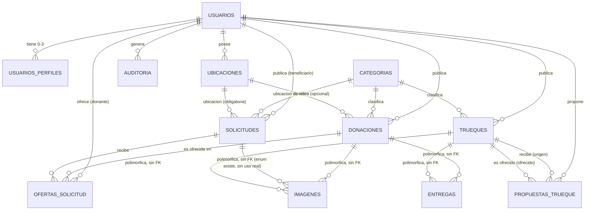
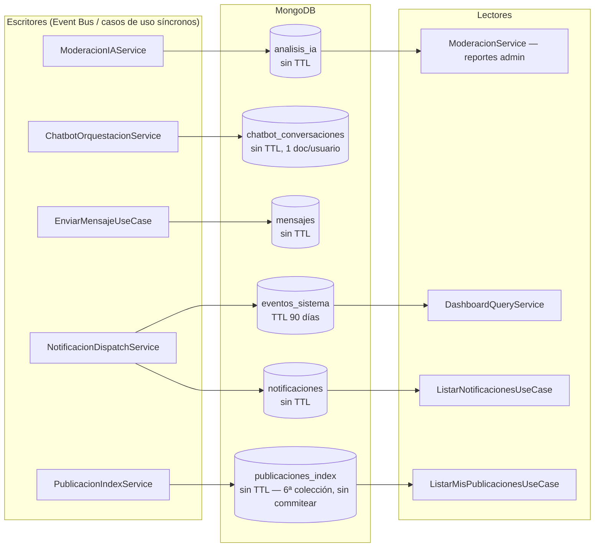

# 10 — PostgreSQL y MongoDB — DonaConnect Ecuador

Diccionario de datos completo, verificado línea por línea contra `backend/prisma/schema.prisma` (368 líneas, leído completo) y contra los 6 modelos Mongoose reales (verificados por agente de exploración con lectura directa de cada archivo, `00_INVENTARIO_PROYECTO.md §4`).

---

## 1. Por qué dos motores (ADR-012, verificado en el esquema real)

**Principio de frontera:** PostgreSQL = estado transaccional con máquinas de estado e invariantes (FK, `UNIQUE`, tipos fuertes); MongoDB = datos conversacionales/append-only donde perder un documento no corrompe ninguna máquina de estado.

Confirmado en la práctica: las 11 tablas de Postgres tienen FK reales y enums estrictos (`Rol`, `EstadoDonacion`, etc.); las 6 colecciones Mongo son documentos con arrays embebidos (mensajes, sesiones) sin relación declarativa entre colecciones — solo referencias por `id` de string, nunca `ObjectId` con `ref` de Mongoose, y **nunca un join directo entre Postgres y Mongo** (confirmado: ningún repositorio Mongoose recibe un `PrismaClient` ni viceversa).

---

## 2. PostgreSQL — diccionario de datos completo (11 tablas)

### `usuarios`

| Columna | Tipo | Constraints | Notas |
|---|---|---|---|
| `id_usuario` | `UUID` | PK, `default(uuid())` | ADR-013 — UUID v4, no autoincremental |
| `nombre` | `VARCHAR(150)` | NOT NULL | |
| `correo` | `VARCHAR(255)` | `UNIQUE`, NOT NULL | Origen de `409 CONFLICT` en registro |
| `password_hash` | `VARCHAR(255)` | NOT NULL | bcrypt, nunca texto plano |
| `telefono` | `VARCHAR(20)` | nullable | |
| `rol` | `enum Rol` (`ADMINISTRADOR`\|`USUARIO`) | NOT NULL | Reducido de 4 a 2 valores por ADR-048 |
| `estado` | `enum EstadoUsuario` (`ACTIVO`\|`SUSPENDIDO`\|`ELIMINADO`) | `default(ACTIVO)` | |
| `fecha_creacion` | `TIMESTAMPTZ` | `default(now())` | |
| Índice | `@@index([rol])` | | |

### `usuarios_perfiles` (nueva, ADR-048 — aditiva, no toca `usuarios`)

| Columna | Tipo | Constraints | Notas |
|---|---|---|---|
| `id_usuario_perfil` | `UUID` | PK | |
| `id_usuario` | `UUID` | FK → `usuarios.id_usuario`, `onDelete: Cascade` | |
| `perfil` | `enum PerfilFuncional` (`DONANTE`\|`SOLICITANTE`\|`TRUEQUE`) | NOT NULL | 3 valores — `COMUNIDAD` removido por ADR-049 |
| `fecha` | `TIMESTAMPTZ` | `default(now())` | |
| Constraint | `@@unique([usuarioId, perfil])` | | Un usuario no puede tener el mismo perfil duplicado |

### `ubicaciones`

| Columna | Tipo | Constraints | Notas |
|---|---|---|---|
| `id_ubicacion` | `UUID` | PK | |
| `id_usuario` | `UUID` | FK → `usuarios`, `onDelete: Cascade` | |
| `provincia` | `VARCHAR(100)` | NOT NULL | |
| `ciudad` | `VARCHAR(100)` | NOT NULL | |
| `sector` | `VARCHAR(150)` | nullable | |
| `referencia` | `VARCHAR(255)` | nullable | |
| `latitud`/`longitud` | `DECIMAL(9,6)` | nullable | Solo referencia GPS opcional — ver `LocationPicker.tsx`, geocodificación inversa vía OSM (no `MAPS_API_KEY`, ver `13_SEGURIDAD.md §9`) |
| `tipo` | `enum TipoUbicacion` (`ESTABLECIDA`\|`RETIRO`) | NOT NULL | |
| Índices | `@@index([usuarioId, tipo])`, `@@index([provincia, ciudad])` | | |

### `categorias`

| Columna | Tipo | Constraints |
|---|---|---|
| `id_categoria` | `UUID` | PK |
| `nombre` | `VARCHAR(100)` | NOT NULL |
| `tipo` | `VARCHAR(50)` | NOT NULL |
| `estado` | `enum EstadoCategoria` (`ACTIVA`\|`INACTIVA`) | `default(ACTIVA)` |
| Constraint | `@@unique([nombre, tipo])` | |

### `donaciones`

| Columna | Tipo | Constraints | Notas |
|---|---|---|---|
| `id_donacion` | `UUID` | PK | |
| `id_donante` | `UUID` | FK → `usuarios` | |
| `id_categoria` | `UUID` | FK → `categorias` | |
| `titulo` | `VARCHAR(150)` | NOT NULL | |
| `descripcion` | `TEXT` | NOT NULL | |
| `estado_objeto` | `enum EstadoObjeto` (`NUEVO`\|`BUEN_ESTADO`\|`USADO`\|`REQUIERE_REPARACION`) | NOT NULL | |
| `estado_donacion` | `enum EstadoDonacion` (6 valores) | `default(PUBLICADA)` | Solo 3 de los 6 valores se usan en código real — ver `11_REGLAS_DE_NEGOCIO.md` |
| `requiere_retiro` | `BOOLEAN` | `default(false)` | |
| `id_ubicacion_retiro` | `UUID` | FK → `ubicaciones`, nullable | Solo si `requiere_retiro` |
| `fecha` | `TIMESTAMPTZ` | `default(now())` | |
| Índices | `estadoDonacion`, `categoriaId`, `donanteId`, `fecha desc` | | |

### `imagenes` (polimórfica, ADR-015)

| Columna | Tipo | Constraints | Notas |
|---|---|---|---|
| `id_imagen` | `UUID` | PK | |
| `tipo_entidad` | `enum TipoEntidadImagen` (`DONACION`\|`SOLICITUD`\|`TRUEQUE`) | NOT NULL | Sin FK física — validado en código |
| `id_entidad` | `UUID` | NOT NULL, sin FK declarativa | Postgres no soporta FK polimórfica nativa |
| `url` | `VARCHAR(500)` | NOT NULL | URL de Cloudinary, nunca BLOB (§5.3 SRS) |
| `public_id` | `VARCHAR(255)` | NOT NULL | Necesario para eventual borrado en Cloudinary |
| `fecha` | `TIMESTAMPTZ` | `default(now())` | |
| Índice | `@@index([tipoEntidad, idEntidad])` | | |

**Hallazgo verificado (`02_TRAZABILIDAD_SRS_CODIGO.md` CU-004):** `tipo_entidad='SOLICITUD'` existe en el enum pero **ninguna fila real se crea con ese valor** — no hay endpoint de imagen para Solicitudes.

### `solicitudes`

| Columna | Tipo | Constraints | Notas |
|---|---|---|---|
| `id_solicitud` | `UUID` | PK | |
| `id_beneficiario` | `UUID` | FK → `usuarios` | |
| `id_categoria` | `UUID` | FK → `categorias` | |
| `titulo`/`descripcion` | `VARCHAR(150)`/`TEXT` | NOT NULL | |
| `urgencia` | `enum Urgencia` (`BAJA`\|`MEDIA`\|`ALTA`) | NOT NULL | ADR-011 — 3 niveles, confirmado por el usuario ante ambigüedad del SRS |
| `estado_solicitud` | `enum EstadoSolicitud` (6 valores) | `default(ABIERTA)` | Solo 3 de 6 se usan en código real |
| `id_ubicacion` | `UUID` | FK → `ubicaciones`, NOT NULL | A diferencia de Donación, siempre requerida |
| `evidencia_url` | `VARCHAR(500)` | nullable | String simple, no relación a `imagenes` — evidencia de la *necesidad*, no del cumplimiento |
| `fecha` | `TIMESTAMPTZ` | `default(now())` | |
| Índices | `estadoSolicitud`, `categoriaId`, `urgencia`, `fecha desc` | | |

### `ofertas_solicitud`

| Columna | Tipo | Constraints | Notas |
|---|---|---|---|
| `id_oferta` | `UUID` | PK | |
| `id_solicitud` | `UUID` | FK → `solicitudes` | |
| `id_donante` | `UUID` | FK → `usuarios` | |
| `id_donacion` | `UUID` | FK → `donaciones` | La donación concreta que el donante ofrece |
| `mensaje` | `TEXT` | nullable | |
| `estado` | `enum EstadoOferta` (`PENDIENTE`\|`ACEPTADA`\|`RECHAZADA`) | `default(PENDIENTE)` | Los 3 valores sí se usan en código (a diferencia de los enums de publicación) |
| `fecha` | `TIMESTAMPTZ` | `default(now())` | |
| Índice | `@@index([solicitudId])` | | |

**Invariante de negocio (ADR-011, no declarativo en BD — validado en `Solicitud.agregarOfertaAceptada()`):** una Solicitud solo permite una oferta `ACEPTADA` activa a la vez.

### `entregas` (polimórfica, ADR-015)

| Columna | Tipo | Constraints | Notas |
|---|---|---|---|
| `id_entrega` | `UUID` | PK | |
| `tipo_operacion` | `enum TipoOperacionEntrega` (`DONACION`\|`TRUEQUE`) | NOT NULL | |
| `id_referencia` | `UUID` | NOT NULL, sin FK declarativa | |
| `modalidad` | `enum ModalidadEntrega` (`RETIRO_DOMICILIO`\|`ENTREGA_DIRECTA`\|`PUNTO_ENCUENTRO`) | NOT NULL | Solo los 2 primeros se asignan en código real |
| `estado` | `enum EstadoEntrega` (`PROGRAMADA`\|`CONFIRMADA`\|`CANCELADA`) | `default(PROGRAMADA)` | Los 3 valores se usan |
| `fecha_programada` | `TIMESTAMPTZ` | nullable | |
| Índices | `(tipoOperacion, idReferencia)`, `estado` | | |

### `trueques`

| Columna | Tipo | Constraints | Notas |
|---|---|---|---|
| `id_trueque` | `UUID` | PK | |
| `id_usuario` | `UUID` | FK → `usuarios` | |
| `id_categoria` | `UUID` | FK → `categorias` | |
| `titulo`/`descripcion` | `VARCHAR(150)`/`TEXT` | NOT NULL | |
| `estado_objeto` | `enum EstadoObjeto` | NOT NULL | Mismo enum que Donación |
| `estado_trueque` | `enum EstadoTrueque` (6 valores) | `default(PUBLICADO)` | Solo 5 de 6 se usan (`ACEPTADO` nunca) |
| `fecha` | `TIMESTAMPTZ` | `default(now())` | |
| Índices | `estadoTrueque`, `categoriaId`, `fecha desc` | | |

**Nota:** `Trueque` **no tiene** columna de ubicación (a diferencia de Donación/Solicitud) — confirmado en `03_ARQUITECTURA.md`/`04_COMUNICACION_ENTRE_CAPAS.md` §8, comentario explícito en `ResponderPropuestaUseCase.ts:73`.

### `propuestas_trueque`

| Columna | Tipo | Constraints | Notas |
|---|---|---|---|
| `id_propuesta` | `UUID` | PK | |
| `id_trueque_origen` | `UUID` | FK → `trueques` (relación nombrada `PropuestasComoOrigen`) | El trueque que RECIBE la propuesta |
| `id_trueque_ofrecido` | `UUID` | FK → `trueques` (relación nombrada `PropuestasComoOfrecido`) | El trueque que el proponente ofrece a cambio |
| `id_usuario_proponente` | `UUID` | FK → `usuarios` | |
| `estado` | `enum EstadoPropuesta` (`PENDIENTE`\|`ACEPTADA`\|`RECHAZADA`) | `default(PENDIENTE)` | Los 3 valores se usan |
| `fecha` | `TIMESTAMPTZ` | `default(now())` | |
| Índice | `@@index([truequeOrigenId])` | | |

**Dos FK a la misma tabla `trueques`** (relación autorreferencial vía 2 nombres de relación distintos en Prisma) — necesario porque una propuesta conecta dos trueques publicados independientemente.

### `auditoria`

| Columna | Tipo | Constraints | Notas |
|---|---|---|---|
| `id_auditoria` | `UUID` | PK | |
| `id_usuario` | `UUID` | FK → `usuarios`, nullable, `onDelete: SetNull` | Nullable para no perder el registro si se elimina el usuario |
| `accion` | `VARCHAR(50)` | NOT NULL | 6 valores reales: `CREAR`,`APROBAR`,`CANCELAR`,`BLOQUEAR`,`ELIMINAR`,`LOGIN_FALLIDO` |
| `entidad` | `VARCHAR(50)` | NOT NULL | |
| `id_entidad` | `UUID` | **NOT NULL** | Causa el gap de auditoría en login con correo inexistente (`13_SEGURIDAD.md §8`) — no hay valor posible cuando el usuario no existe |
| `detalle` | `JSON` | nullable | |
| `fecha` | `TIMESTAMPTZ` | `default(now())` | |
| Índices | `(entidad, idEntidad)`, `fecha desc`, `usuarioId` | | |

---

## 3. Diagrama entidad-relación (PostgreSQL)

---

## 4. MongoDB — diccionario de colecciones completo (6 colecciones)

### `analisis_ia`

| Campo | Tipo | Notas |
|---|---|---|
| `tipo` | enum (`CLASIFICACION`\|`MODERACION`) | |
| `tipoEntidad` | enum (`DONACION`\|`SOLICITUD`\|`TRUEQUE`) | |
| `entidadId` | String | |
| `prompt`/`respuestaIA` | String, requeridos | |
| `categoriaSugerida`/`prioridad`/`categoriaRiesgo`/`explicacion` | String, default `null` | |
| `score`/`confianza` | Number, default `null` | |
| `riesgoDetectado` | Boolean, default `null` | |
| `fecha` | Date, default `now` | |

Índices: `tipo`, `tipoEntidad`, `entidadId`, `fecha` (simples). **Sin TTL** — valor histórico para mejorar clasificación/matching (ADR-014). Escribe `ModeracionIAService`; lee `ModeracionService` (reportes admin).

### `chatbot_conversaciones`

| Campo | Tipo | Notas |
|---|---|---|
| `usuarioId` | String, index | 1 documento por usuario |
| `sesiones` | `[{sesionId, iniciadoEn}]` | subdocumento `_id:false` |
| `mensajes` | `[{rol:'usuario'\|'bot', texto, timestamp}]` | subdocumento `_id:false`, acotado a los últimos 15 en cada llamada al modelo |
| `canal` | String, default `'web'` | |
| `fecha` | Date, index | |

Sin TTL. Escribe/lee `ChatbotOrquestacionService`.

### `mensajes`

| Campo | Tipo | Notas |
|---|---|---|
| `_id` | String | forzado manualmente (no `ObjectId` autogenerado) |
| `participantes` | `[String]`, index | 2 usuarios |
| `entregaIdReferencia` | String\|null | **nunca asignado** desde ningún caso de uso — campo preparado, incompleto |
| `mensajes` | `[{autorId, texto, fecha, leido}]` | subdocumento `_id:false` |
| `fecha` | Date | |

Sin TTL. Escribe/lee los 3 casos de uso de `application/mensajeria/`.

### `eventos_sistema`

| Campo | Tipo | Notas |
|---|---|---|
| `usuarioId` | String\|null, index | |
| `tipoEvento` | String, index | |
| `entidad`/`referenciaId` | String, requeridos | |
| `metadatos` | Mixed, default `{}` | |
| `fecha` | Date, default `now` | |

**Único con TTL: `expireAfterSeconds: 90*24*60*60` = 7 776 000s = 90 días (ADR-014).** Solo 3 tipos de evento reales: `SolicitudAtendida`, `TruequeIntercambiado`, `EntregaConfirmada` — "eventos de cierre positivo" para el Dashboard KPI. Escribe `NotificacionDispatchService.registrarEventoKpi`; lee `DashboardQueryService`.

### `notificaciones`

| Campo | Tipo | Notas |
|---|---|---|
| `usuarioId` | String, requerido, index | |
| `tipo` | String, requerido | |
| `entidadTipo`/`entidadRelacionada` | String, default `null` | extensión post-cierre, para navegación desde el frontend |
| `mensaje` | String, requerido | |
| `leido` | Boolean, default `false` | |
| `canal` | String, default `'app'` | Solo canal real; correo removido (ADR-047) |
| `fecha` | Date, index | |

Sin TTL. Escribe `NotificacionDispatchService` (13 métodos `al*`); lee `ListarNotificacionesUseCase`/`MarcarLeidoUseCase`.

### `publicaciones_index` (6ª colección — nueva, sin commitear, no documentada en ningún ADR)

| Campo | Tipo | Notas |
|---|---|---|
| `id` | String, requerido, **único** | Es el `id` de Postgres de la donación/solicitud/trueque, no un `_id` propio de Mongo |
| `tipo` | String (`DONACION`\|`SOLICITUD`\|`TRUEQUE`) | |
| `titulo`/`estado`/`usuarioId` | String, `usuarioId` index | |
| `fecha`/`actualizadoEn` | Date | |

Índices: `usuarioId`, `id` (único). Sin TTL — justificado explícitamente en el propio código frente al TTL de `eventos_sistema`. Escribe `PublicacionIndexService` (8 suscripciones al Event Bus); lee `ListarMisPublicacionesUseCase` (`GET /publicaciones/mias`).

---

## 5. Diagrama de colecciones (MongoDB)

---

## 6. Mapa de referencias entre PostgreSQL y MongoDB

Ninguna colección Mongo tiene una FK declarativa hacia Postgres (imposible entre motores distintos) — todas las referencias son **IDs de string sin integridad referencial garantizada por la base de datos**, validadas (cuando se validan) en la capa de aplicación:

| Campo Mongo | Referencia a Postgres | ¿Se valida existencia? |
|---|---|---|
| `analisis_ia.entidadId` | `donaciones.id` / `solicitudes.id` / `trueques.id` | Implícito — se escribe en el mismo caso de uso que ya validó la entidad |
| `notificaciones.entidadRelacionada` | idem | Implícito |
| `publicaciones_index.id` | idem (es el mismo UUID) | Implícito — proyección derivada de eventos ya validados |
| `mensajes.participantes[]` | `usuarios.id` × 2 | Sí — `EnviarMensajeUseCase` valida `usuarioRepository.buscarPorId` antes de crear |
| `chatbot_conversaciones.usuarioId` | `usuarios.id` | Implícito — viene del JWT ya verificado |
| `eventos_sistema.usuarioId` | `usuarios.id`, nullable | No crítico — es un log de KPI |
| `mensajes.entregaIdReferencia` | `entregas.id` | **N/A — nunca se asigna, campo muerto** |

**Qué pasa si una operación se completa en una base y falla en la otra (pregunta típica de defensa):** no hay transacción distribuida entre Postgres y Mongo — no existe ese mecanismo entre motores distintos sin un patrón adicional (ej. Saga, outbox). En la práctica, el diseño mitiga el riesgo por naturaleza de los datos: las escrituras Mongo son siempre "de segundo orden" (notificación, log, índice de lectura) disparadas *después* de que la escritura Postgres ya se confirmó — si la reacción Mongo falla, el estado de negocio en Postgres ya quedó correcto y consistente; en el peor caso, falta una notificación o el índice de "mis publicaciones" queda desactualizado, nunca se corrompe una máquina de estado real. Esto es consistente con el principio de frontera de ADR-012, no es un mecanismo transaccional formal.

---

## 7. Qué sigue

Con este diccionario completo, `11_REGLAS_DE_NEGOCIO.md` puede enfocarse en el comportamiento (transiciones, guardas, excepciones) sin repetir el detalle de columnas/campos ya cubierto aquí.
