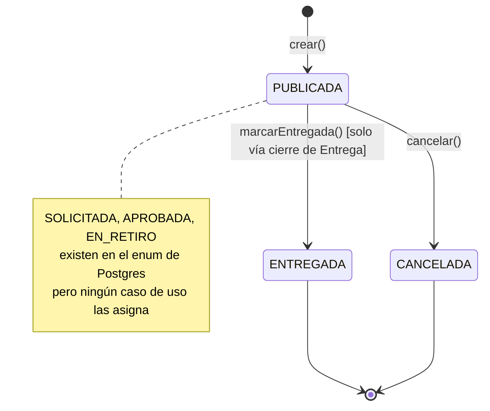
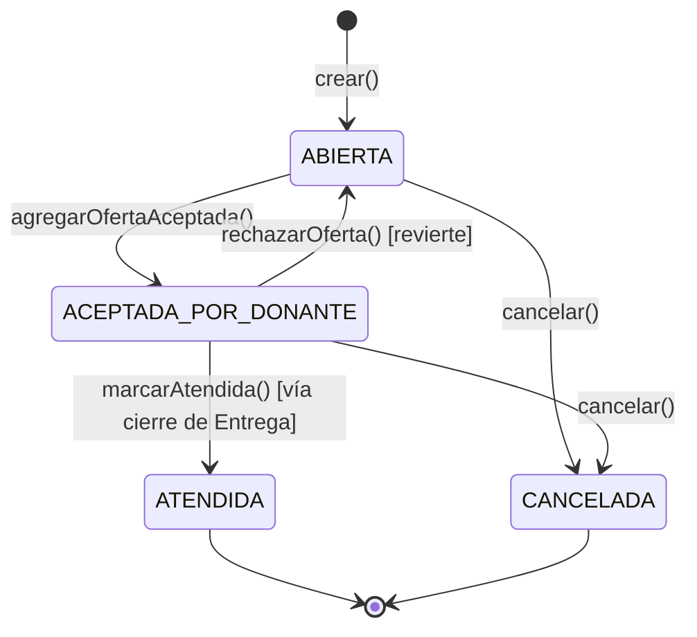
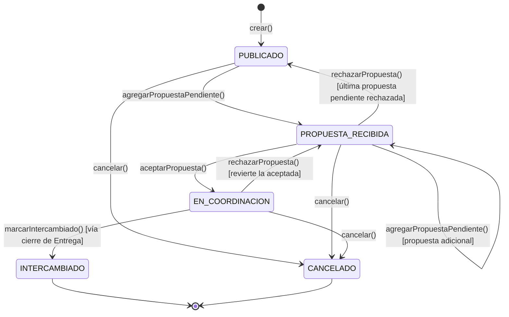
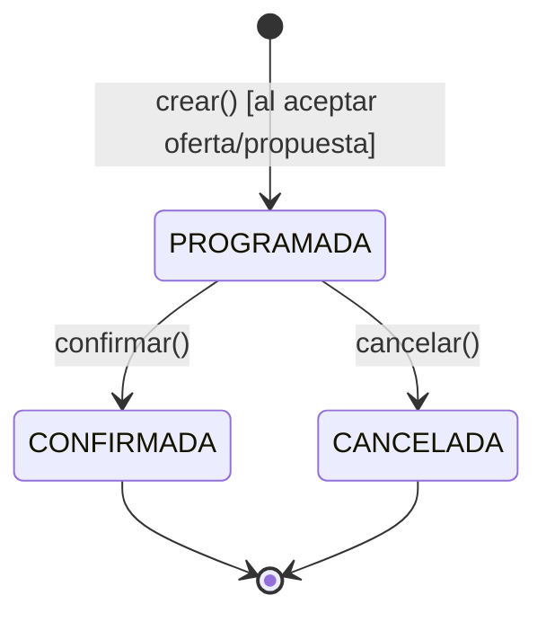

# 11 — Reglas de Negocio y Máquinas de Estado — DonaConnect Ecuador

Comportamiento real de las 4 entidades con máquina de estado, verificado método por método (línea exacta, guarda, excepción) contra `backend/domain/{donaciones,solicitudes,trueques,entregas}/entities/*.ts`. Complementa el diccionario de datos de `10_POSTGRESQL_Y_MONGODB.md` (que documenta los campos) enfocándose en el comportamiento (qué transiciones son posibles y qué las bloquea).

---

## 1. `Donacion` (`domain/donaciones/entities/Donacion.ts`, 191 líneas)

| Método | Línea | Transición | Guarda | Excepción si falla |
|---|---|---|---|---|
| `crear()` | 66-87 | `— → PUBLICADA` | — | — |
| `actualizar()` | 141-146 | sin cambio de `estadoDonacion` (solo `estadoObjeto`/título/descripción) | `!estaFinalizada()` | `DonacionYaFinalizadaError` |
| `cancelar()` | 148-151 | `PUBLICADA → CANCELADA` | `!estaFinalizada()` | `DonacionYaFinalizadaError` |
| `marcarEntregada()` | 155-158 | `PUBLICADA → ENTREGADA` | `!estaFinalizada()` | `DonacionYaFinalizadaError` |

`esEstadoTerminal` (`EstadoDonacion.ts:11-15`): `{ENTREGADA, CANCELADA}`. Estados del enum de Prisma **nunca asignados en código**: `SOLICITADA`, `APROBADA`, `EN_RETIRO` (remanentes de Fase 3, confirmado por grep exhaustivo en `application/`+`domain/`).

`marcarEntregada()` **nunca se invoca desde un endpoint directo** — solo la invoca `EntregaCierreOrigenService.cerrarOrigen()` cuando se confirma la Entrega asociada (§4).

---

## 2. `Solicitud` (`domain/solicitudes/entities/Solicitud.ts`, 275 líneas)

| Método | Línea | Transición | Guarda | Excepción |
|---|---|---|---|---|
| `crear()` | 114-131 | `— → ABIERTA` | — | — |
| `actualizar()` | 197-202 | sin cambio de estado | `!estaFinalizada()` | `SolicitudYaFinalizadaError` |
| `cancelar()` | 204-207 | `* → CANCELADA` (no terminal) | `!estaFinalizada()` | `SolicitudYaFinalizadaError` |
| `marcarAtendida()` | 211-214 | `ACEPTADA_POR_DONANTE → ATENDIDA` | `!estaFinalizada()` | `SolicitudYaFinalizadaError` |
| `agregarOfertaAceptada()` | 217-227 | `{ABIERTA,EN_REVISION} → ACEPTADA_POR_DONANTE` | `puedeRecibirOferta()` (línea 189-191) + sin oferta duplicada del mismo donante | `SolicitudNoAceptaOfertasError` / `OfertaDuplicadaError` |
| `rechazarOferta()` | 230-238 | si era la aceptada: `ACEPTADA_POR_DONANTE → ABIERTA` (revierte) | oferta existe y no rechazada ya | `OfertaNoEncontradaEnSolicitudError` / `OfertaYaRechazadaError` |

`esEstadoTerminal` (`EstadoSolicitud.ts:11-15`): `{ATENDIDA, CANCELADA}`. Nunca asignados en código: `EN_ENTREGA` (cero ocurrencias); `EN_REVISION` está definido y se **lee** en la guarda `puedeRecibirOferta()` pero **tampoco se asigna nunca** — ninguna acción del sistema pone una Solicitud en ese estado.

**RF-009, decisión de bajo riesgo (Fase 4):** `agregarOfertaAceptada()` no es "agregar una oferta pendiente que luego se acepta" — la oferta nace ya `ACEPTADA` en el mismo paso. No hay negociación previa como sí existe en Trueque.

---

## 3. `Trueque` (`domain/trueques/entities/Trueque.ts`, 287 líneas) — el único con negociación de 2 pasos real

| Método | Línea | Transición | Guarda | Excepción |
|---|---|---|---|---|
| `crear()` | 102-117 | `— → PUBLICADO` | — | — |
| `actualizar()` | 173-178 | sin cambio de estado | `!estaFinalizado()` | `TruequeYaFinalizadoError` |
| `cancelar()` | 180-183 | `* → CANCELADO` | `!estaFinalizado()` | `TruequeYaFinalizadoError` |
| `marcarIntercambiado()` | 187-190 | `EN_COORDINACION → INTERCAMBIADO` | `!estaFinalizado()` | `TruequeYaFinalizadoError` |
| `agregarPropuestaPendiente()` | 197-208 | `PUBLICADO → PROPUESTA_RECIBIDA` (si era `PUBLICADO`); sin cambio si ya estaba `PROPUESTA_RECIBIDA` | `puedeRecibirPropuesta()` (169-171) + sin propuesta duplicada del mismo proponente | `TruequeNoAceptaPropuestasError` / `PropuestaDuplicadaError` |
| `aceptarPropuesta()` | 211-224 | `* → EN_COORDINACION` | no finalizado + propuesta existe, no rechazada, no ya aceptada | `TruequeYaFinalizadoError` / `PropuestaNoEncontradaEnTruequeError` / `PropuestaYaRechazadaError` / `PropuestaYaAceptadaError` |
| `rechazarPropuesta()` | 229-247 | si era la aceptada: `EN_COORDINACION → PROPUESTA_RECIBIDA`; si no quedan pendientes: `PROPUESTA_RECIBIDA → PUBLICADO` | propuesta existe, no rechazada ya | `PropuestaNoEncontradaEnTruequeError` / `PropuestaYaRechazadaError` |
| `marcarEnCoordinacion()` | 251-254 | `* → EN_COORDINACION` (aplica al *otro* aggregate, el trueque ofrecido) | `!estaFinalizado()` | `TruequeYaFinalizadoError` |
| `revertirDeCoordinacion()` | 256-260 | `EN_COORDINACION → PUBLICADO` | ninguna (idempotente) | — |

`esEstadoTerminal` (`EstadoTrueque.ts:11-15`): `{INTERCAMBIADO, CANCELADO}`. Nunca asignado: `ACEPTADO` — la transición real salta directo `PROPUESTA_RECIBIDA → EN_COORDINACION`, sin pasar por un estado `ACEPTADO` intermedio pese a que el enum de Prisma lo define.

**Por qué Trueque necesita 2 métodos para "aceptar" (`aceptarPropuesta()` + `marcarEnCoordinacion()`):** una propuesta conecta **dos aggregates independientes** (trueque origen y trueque ofrecido, dos filas de `trueques`). `ResponderPropuestaUseCase` (ver `04_COMUNICACION_ENTRE_CAPAS.md §8`) llama ambos métodos, uno por cada lado, dentro de la misma transacción HTTP — es la única entidad de las 3 donde una sola acción de usuario transiciona dos aggregates a la vez.

---

## 4. `Entrega` (`domain/entregas/entities/Entrega.ts`, 93 líneas) — polimórfica, cierra ambos flujos

| Método | Línea | Transición | Guarda | Excepción |
|---|---|---|---|---|
| `crear()` | 35-42 | `— → PROGRAMADA` | — | — |
| `confirmar(fechaProgramada?)` | 72-76 | `PROGRAMADA → CONFIRMADA` | `!estaFinalizada()` | `EntregaYaFinalizadaError` |
| `cancelar()` | 78-81 | `PROGRAMADA → CANCELADA` | `!estaFinalizada()` | `EntregaYaFinalizadaError` |

`esEstadoTerminal` (`EstadoEntrega.ts:6-8`): `{CONFIRMADA, CANCELADA}`. Los 3 valores del enum se usan en código real (a diferencia de las otras 3 entidades).

`ModalidadEntrega`: `RETIRO_DOMICILIO`\|`ENTREGA_DIRECTA`\|`PUNTO_ENCUENTRO` — decidida en `EntregaCoordinacionService.ts:24` con una condición binaria (`requiereRetiro ? RETIRO_DOMICILIO : ENTREGA_DIRECTA`); **`PUNTO_ENCUENTRO` nunca se asigna** en ningún caso de uso.

**Efecto colateral al confirmar (`EntregaCierreOrigenService.cerrarOrigen`, ver `04_COMUNICACION_ENTRE_CAPAS.md §10`):** confirmar una Entrega dispara, en la misma petición HTTP (síncrono, no Event Bus), la transición del aggregate ORIGEN a su estado terminal positivo:
- `DONACION` → `Donacion.marcarEntregada()` + (si existe) `Solicitud.marcarAtendida()` de la solicitud cuya oferta fue aceptada con esa donación
- `TRUEQUE` → `Trueque.marcarIntercambiado()` en **ambos** lados (origen y ofrecido)

---

## 5. Invariantes de negocio explícitos (ADR-011 — confirmados vía código, no solo documentados)

| # | Invariante | Dónde se hace cumplir | Evidencia |
|---|---|---|---|
| 1 | Una Solicitud solo permite **una** oferta `ACEPTADA` activa a la vez | `Solicitud.agregarOfertaAceptada()` — si ya hay una aceptada, el estado deja de estar en `puedeRecibirOferta()` | `Solicitud.ts:189-191,217-227` |
| 2 | Un Trueque solo permite **una** propuesta `ACEPTADA` activa a la vez | `Trueque.aceptarPropuesta()` guarda `PropuestaYaAceptadaError`; solo desde `PROPUESTA_RECIBIDA`/`PUBLICADO` se pueden recibir nuevas | `Trueque.ts:211-224` |
| 3 | `Urgencia` de 3 niveles (`BAJA`\|`MEDIA`\|`ALTA`) | Enum de Prisma, sin nivel adicional | `schema.prisma:195-201` |
| 4 | No auto-oferta/auto-propuesta | `CrearOfertaUseCase` (`NoPuedeOfertarSobrePropiaSolicitudError`), `ProponerTruequeUseCase` (`NoPuedeProponerSobrePropioTruequeError`) | `12_API_ENDPOINTS.md §3,§4` |
| 5 | No auto-mensaje | `EnviarMensajeUseCase.ts:37-39` (`NoPuedeEnviarseMensajeAsiMismoError`) | — |
| 6 | Ubicación exacta oculta salvo dueño/admin (ADR-019) | `ObtenerDonacionUseCase`/`ObtenerSolicitudUseCase` — con el matiz de revelación puntual en `CrearOfertaUseCase.ts:89` | `13_SEGURIDAD.md §3` |
| 7 | Moderación IA nunca bloquea la publicación (ADR-010/027, human-in-the-loop) | `ModeracionIAService.evaluarYRegistrar` solo registra y notifica, nunca cancela/oculta | `04_COMUNICACION_ENTRE_CAPAS.md §3` |
| 8 | Cierre de flujo Must-have es síncrono, no depende del Event Bus | `EntregaCierreOrigenService` — comentario explícito contrastándolo con la moderación IA (Should-have) | `EntregaCierreOrigenService.ts:11-18` |

---

## 6. Matriz de autorización real (perfil/rol → acción)

| Acción | Guard | Perfil/Rol requerido | Autorización de recurso adicional (en el caso de uso) |
|---|---|---|---|
| Publicar Donación | `perfilMiddleware` | `DONANTE` | — |
| Publicar Solicitud | `perfilMiddleware` | `SOLICITANTE` | — |
| Publicar/Proponer Trueque | `perfilMiddleware` | `TRUEQUE` | — |
| Ofertar sobre Solicitud ajena | `perfilMiddleware` | `DONANTE` | no puede ser dueño de la solicitud ni de una donación ajena |
| Actualizar/Cancelar Donación/Solicitud/Trueque | ninguno a nivel de ruta | cualquier autenticado | **debe ser el dueño** (`NoEsDueñoDeLa*Error`) — verificado dentro del caso de uso |
| Rechazar oferta / Responder propuesta | ninguno a nivel de ruta | cualquier autenticado | debe ser el dueño de la Solicitud/Trueque origen |
| Confirmar/Cancelar Entrega | ninguno a nivel de ruta | cualquier autenticado | `NoAutorizadoParaLaEntregaError` — verificado en `ObtenerEntregaUseCase`/`ActualizarEntregaUseCase` |
| Moderar (aprobar/bloquear/eliminar) | `rbacMiddleware` | `ADMINISTRADOR` | — |
| Crear/editar Categoría | `rbacMiddleware` | `ADMINISTRADOR` | — |

**Nota de diseño confirmada (ADR-048):** la autorización de "quién puede hacer qué tipo de acción de marketplace" vive en `perfilMiddleware` (a nivel de ruta); la autorización de "quién puede modificar ESTE recurso específico" vive siempre dentro del caso de uso — nunca en un middleware separado, decisión documentada explícitamente para evitar una segunda consulta redundante (`fase-06-backend.md`, historial Sprint 1).

---

## 7. Qué sigue

Con `10_POSTGRESQL_Y_MONGODB.md` (datos) y este documento (comportamiento) cerrados, el conjunto `00,02,03,04,10,11,12,13,17` — 9 de 23 — cubre inventario, trazabilidad, arquitectura, flujos, datos, reglas de negocio, endpoints, seguridad y deuda técnica. Quedan 14: línea por línea de código, construcción desde cero, librerías, IA en detalle, Docker en detalle, frontend y roles, servicios externos, pruebas, informe técnico consolidado, guion de exposición, banco de 80 preguntas, glosario, resumen ejecutivo y el README técnico índice.
